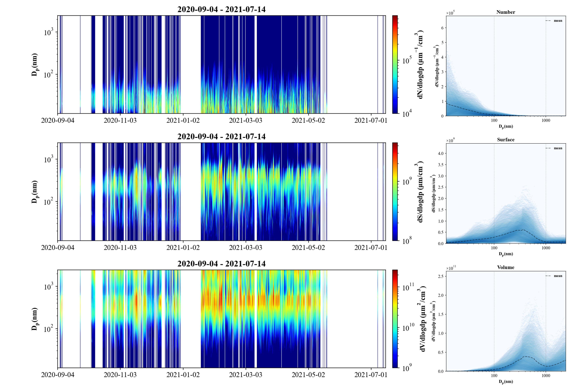
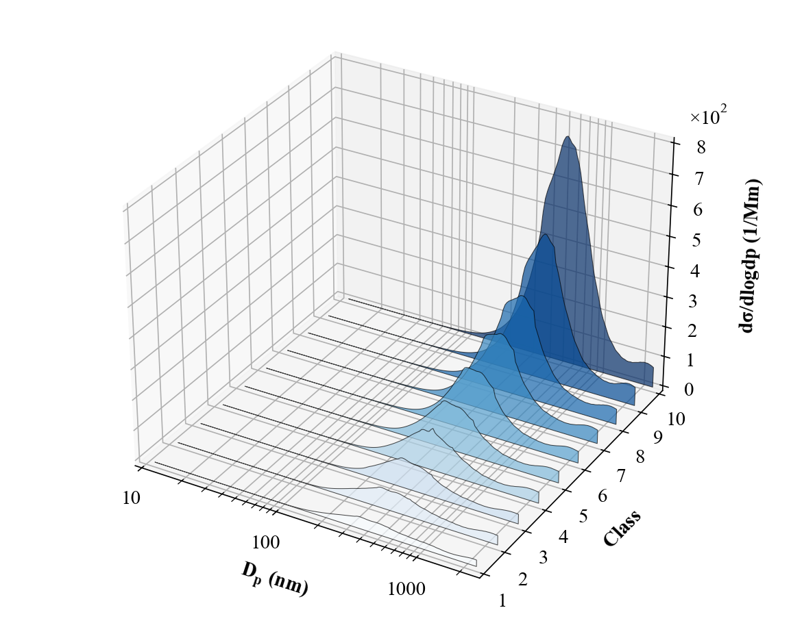
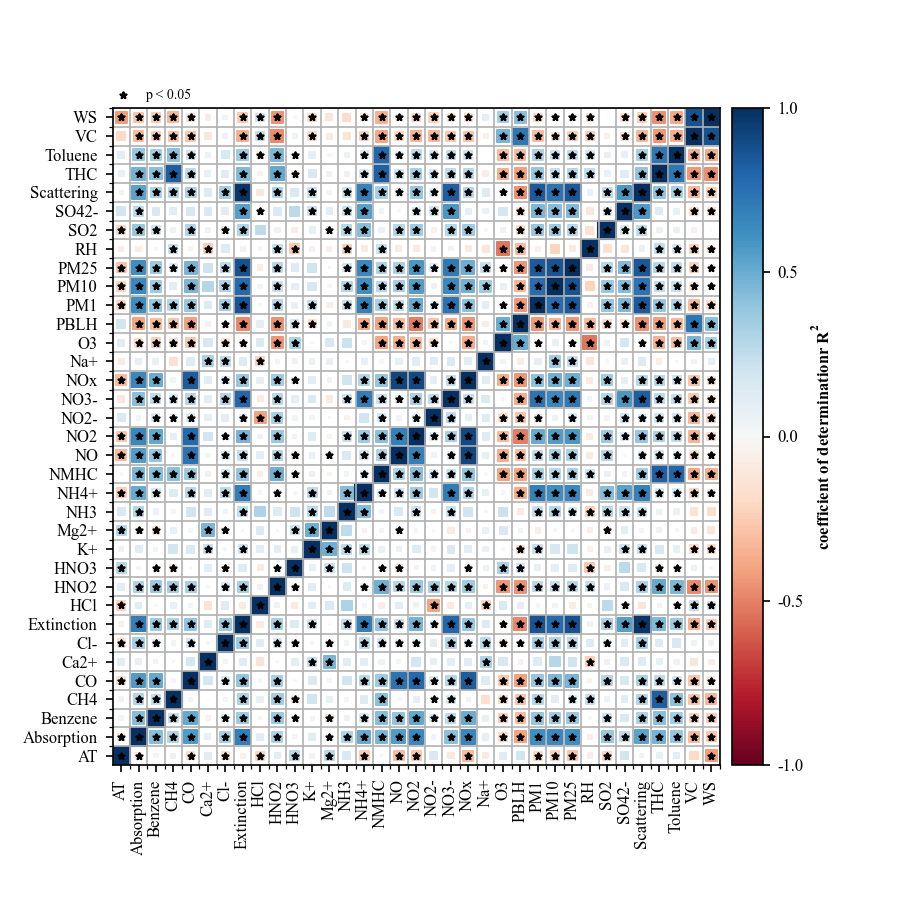
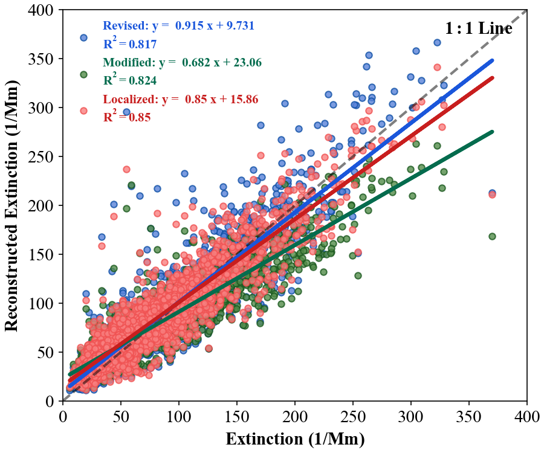
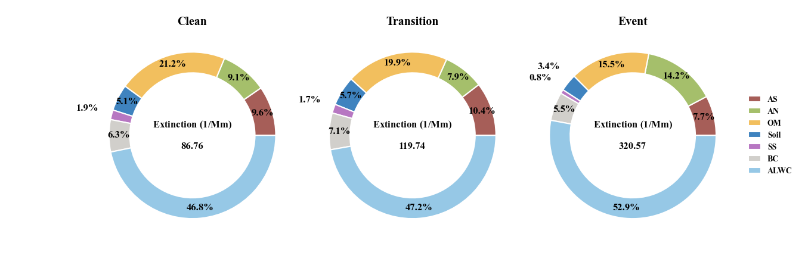
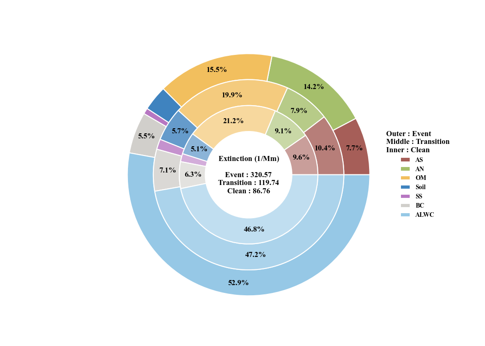
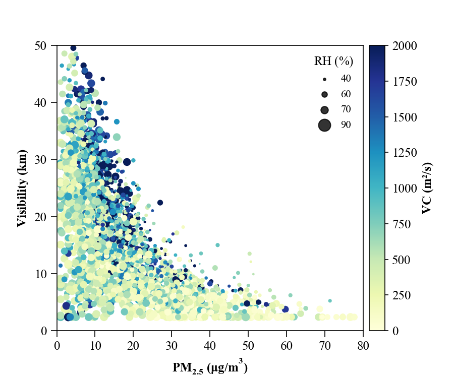
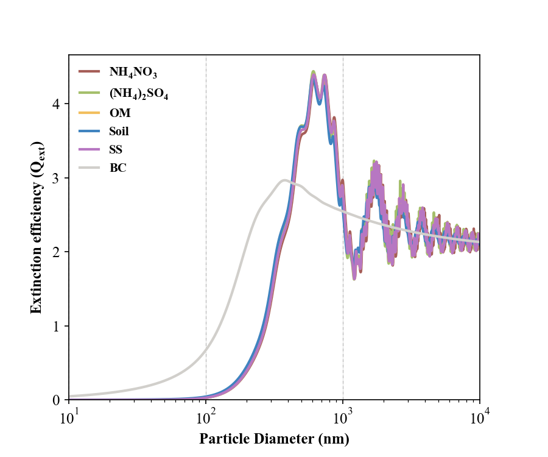
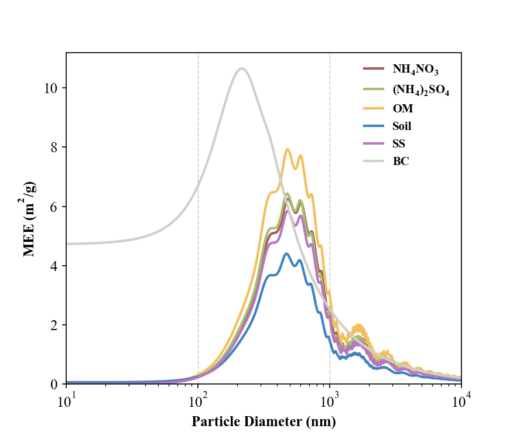

# Gallery

What the plot families produce. Every example uses the bundled dataset
(`DataBase(load_data=True)`); swap in your own frame.

### Wind rose and CBPF


```python
from AeroViz import plot, DataBase

df = DataBase(load_data=True)

plot.meteorology.wind_rose(df, 'WS', 'WD', typ='bar')
plot.meteorology.wind_rose(df, 'WS', 'WD', 'PM2.5', typ='scatter')

plot.meteorology.CBPF(df, 'WS', 'WD', 'PM2.5')
plot.meteorology.CBPF(df, 'WS', 'WD', 'PM2.5', percentile=[75, 100])
```

### Regression

```python
plot.linear_regression(df, x='PM25', y='Extinction')
plot.linear_regression(df, x='PM25', y=['Extinction', 'Scattering', 'Absorption'])

plot.multiple_linear_regression(df, x=['AS', 'AN', 'OM', 'EC', 'SS', 'Soil'], y=['Extinction'])
plot.multiple_linear_regression(df, x=['NO', 'NO2', 'CO', 'PM1'], y=['PM25'])
```

### Time series

```python
plot.timeseries(df,
                y=['Extinction', 'Scattering'],
                color=[None, None],
                style=['line', 'line'],
                times=('2021-02-01', '2021-03-31'), ylim=[0, None], ylim2=[0, None], rolling=50,
                inset_kws2=dict(bbox_to_anchor=(1.12, 0, 1.2, 1)))

plot.timeseries(df, y='WS', color='WD', style='scatter', times=('2020-10-01', '2020-11-30'),
                scatter_kws=dict(cmap='hsv'), cbar_kws=dict(ticks=[0, 90, 180, 270, 360]),
                ylim=[0, None])

plot.timeseries_template(df.loc['2021-02-01':'2021-03-31'])
```

### Particle size distribution

!!! info
    The distribution plots take SMPS / APS data in `dX/dlogDp` units — exactly
    what `RawDataReader` returns — and can be converted to surface-area and
    volume weightings; with chemical composition the same matrix feeds the Mie
    extinction calculation.



```python
PNSD = DataBase(load_PSD=True)

plot.distribution.heatmap(PNSD, unit='Number')
plot.distribution.heatmap_tms(PNSD, unit='Number', freq='60d')
```

### Other

| **Three-dimensional PSD** | **Correlation matrix** | **Multiple linear regression** |
|:---:|:---:|:---:|
|  |  |  |
| **Pie and donut** | **Donuts** | **Scatter** |
|  |  |  |

| **Mie efficiency (Q)** | **Mass extinction efficiency** |
|:---:|:---:|
|  |  |
