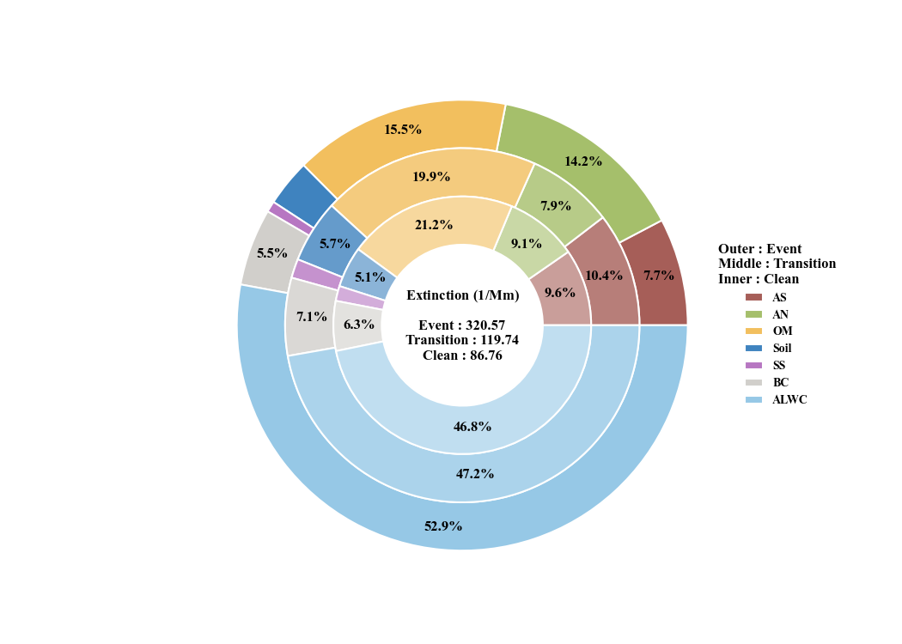

# Plot Documentation

## Overview

The plot module provides visualization tools for creating publication-quality plots of aerosol data. It includes various
plot types commonly used in aerosol science.

## Basic Usage

```python
from AeroViz import plot

# Create a time series plot
plot.time_series(data, 'BC')

# Create a scatter plot
plot.scatter(data, 'BC', 'PM2.5')
```

## Available Plot Types

### time_series()

Create a time series plot of specified variables.

```python
plot.time_series(
    data,
    variables=['BC', 'PM2.5'],
    start='2024-01-01',
    end='2024-12-31',
    title='Time Series of BC and PM2.5'
)
```

### scatter()

Create a scatter plot of two variables.

```python
plot.scatter(
    data,
    x='BC',
    y='PM2.5',
    color='PM2.5',
    size='BC'
)
```

### box()

Create a box plot of specified variables.

```python
plot.box(
    data,
    variables=['BC', 'PM2.5'],
    by='month'
)
```

### histogram()

Create a histogram of specified variables.

```python
plot.histogram(
    data,
    variables=['BC'],
    bins=50
)
```

## Parameters

### Common Parameters

- `data` (DataFrame): Input data
- `variables` (list): Variables to plot
- `title` (str): Plot title
- `figsize` (tuple): Figure size
- `style` (str): Plot style

### Time Series Parameters

- `start` (str): Start date
- `end` (str): End date
- `freq` (str): Time frequency

### Scatter Parameters

- `x` (str): X-axis variable
- `y` (str): Y-axis variable
- `color` (str): Color variable
- `size` (str): Size variable

## Examples

### Time Series with Multiple Variables

```python
plot.time_series(
    data,
    variables=['BC', 'PM2.5', 'PM10'],
    start='2024-01-01',
    end='2024-12-31',
    title='Aerosol Components Time Series'
)
```

### Scatter Plot with Color and Size

```python
plot.scatter(
    data,
    x='BC',
    y='PM2.5',
    color='PM10',
    size='PM1',
    title='BC vs PM2.5'
)
```

### Box Plot by Month

```python
plot.box(
    data,
    variables=['BC'],
    by='month',
    title='Monthly BC Distribution'
)
```

## Notes

- All plots are customizable with various parameters
- Plots can be saved in multiple formats (PNG, PDF, etc.)
- The plot module uses matplotlib and seaborn under the hood
- Publication-quality settings are applied by default

## <div align="center">WindRose and Conditional Bivariate Probability Function (CBPF)</div>


```python
from AeroViz import plot, DataBase

df = DataBase()  # build default data, uers can use their own data

# wind rose
plot.meteorology.wind_rose(df, 'WS', 'WD', typ='bar')
plot.meteorology.wind_rose(df, 'WS', 'WD', 'PM2.5', typ='scatter')

plot.meteorology.CBPF(df, 'WS', 'WD', 'PM2.5')
plot.meteorology.CBPF(df, 'WS', 'WD', 'PM2.5', percentile=[75, 100])
```

### <div align="center">Linear Regression</div>

```python
from AeroViz import plot, DataBase

df = DataBase()  # build default data, uers can use their own data

# regression
plot.linear_regression(df, x='PM25', y='Extinction')
plot.linear_regression(df, x='PM25', y=['Extinction', 'Scattering', 'Absorption'])

plot.multiple_linear_regression(df, x=['AS', 'AN', 'OM', 'EC', 'SS', 'Soil'], y=['Extinction'])
plot.multiple_linear_regression(df, x=['NO', 'NO2', 'CO', 'PM1'], y=['PM25'])


```

### <div align="center">Timeseries</div>

```python
from AeroViz import plot, DataBase

df = DataBase()  # build default data, uers can use their own data

# timeseries
plot.timeseries.timeseries(df,
                           y=['Extinction', 'Scattering'],
                           color=[None, None],
                           style=['line', 'line'],
                           times=('2021-02-01', '2021-03-31'), ylim=[0, None], ylim2=[0, None], rolling=50,
                           inset_kws2=dict(bbox_to_anchor=(1.12, 0, 1.2, 1)))

plot.timeseries.timeseries(df, y='WS', color='WD', style='scatter', times=('2020-10-01', '2020-11-30'),
                           scatter_kws=dict(cmap='hsv'), cbar_kws=dict(ticks=[0, 90, 180, 270, 360]),
                           ylim=[0, None])

plot.timeseries.timeseries_template(df.loc['2021-02-01', '2021-03-31'])
```

### <div align="center">Particle Size Distribution</div>

> [!IMPORTANT]\
> The provided code of distribution suitable for SMPS and APS data in "dX/dlogdp" unit.
> It can be converted into surface area and volume distribution. At the same time,
> chemical composition data can also be used to calculate particle extinction through Mie theory.


```python
from pathlib import Path
from AeroViz import plot
from AeroViz.tools import DataBase

df = DataBase()  # build default data, uers can use their own data

PNSD = DataBase('DEFAULT_PNSD_DATA.csv')

plot.distribution.distribution.heatmap(PNSD, unit='Number')
plot.distribution.distribution.heatmap_tms(PNSD, unit='Number', freq='60d')
```

### <div align="center">For some basic plot</div>

|                  **Three_dimension**                   |                  **Correlation Matrix**                  |           **Mutiply Linear Regression**           |
|:------------------------------------------------------:|:--------------------------------------------------------:|:-------------------------------------------------:|
|                 |  |  |
|                    **Pie & Donut**                     |                        **Dounts**                        |                    **Scatter**                    |
|  |      |          |

### <div align="center">PyMieScatt</div>

|               **Mie_Q**               |                **Mie_MEE**                |
|:-------------------------------------:|:-----------------------------------------:|
|  |  |
