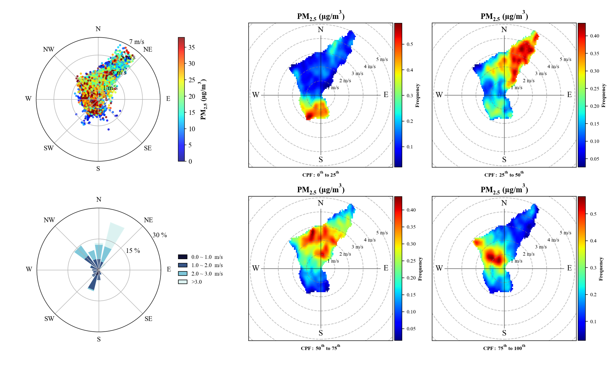

# AeroViz

A modern Python package for aerosol data processing and visualization

<div class="card-container">
    <div class="doc-card">
        <div class="card-icon">
            <i class="fa fa-flag-checkered"></i>
        </div>
        <div class="card-title">Getting started</div>
        <div class="card-desc">
            New to AeroViz? Check out the Beginner's Guide. It contains an introduction to AeroViz's main features and examples to get you started quickly.
        </div>
        <div class="card-action">
            <a href="guide/" class="card-button">To the beginner's guide</a>
        </div>
    </div>
    <div class="doc-card">
        <div class="card-icon">
            <i class="fa fa-book"></i>
        </div>
        <div class="card-title">User guide</div>
        <div class="card-desc">
            The user guide provides in-depth information on key concepts of AeroViz with detailed explanations of data processing and visualization capabilities.
        </div>
        <div class="card-action">
            <a href="guide/data-levels/" class="card-button">To the user guide</a>
        </div>
    </div>
    <div class="doc-card">
        <div class="card-icon">
            <i class="fa fa-wand-magic-sparkles"></i>
        </div>
        <div class="card-title">API reference</div>
        <div class="card-desc">
            The reference guide contains detailed descriptions of the functions, classes, and methods included in AeroViz. It assumes that you have an understanding of the key concepts.
        </div>
        <div class="card-action">
            <a href="api/" class="card-button">To the reference guide</a>
        </div>
    </div>
    <div class="doc-card">
        <div class="card-icon">
            
        </div>
        <div class="card-title">AeroViz</div>
        <div class="card-desc">
            A platform for real-time monitoring, offering data visualization and analytical insights.
        </div>
        <div class="card-action">
            <a href="https://aeroviz.org/" class="card-button">Visit Website</a>
        </div>
    </div>

</div>

## **Quick Start**

Here's a simple example of how to use AeroViz:

```python
from datetime import datetime
from pathlib import Path
from AeroViz import RawDataReader, improve, plot

# Read data from a supported instrument
df_ae33 = RawDataReader(
    instrument='AE33',
    path=Path('/path/to/folder'),
    start=datetime(2024, 1, 1),
    end=datetime(2024, 12, 31)
)

# Post-process with top-level functions (e.g. IMPROVE extinction from
# reconstructed PM mass and RH); see the Guide for the full pipeline.
# result = improve(df_mass, df_RH, method='revised')

# Create visualization (y = column name or list of columns)
plot.timeseries(df_ae33, y='eBC')
```

For detailed tutorials and examples, see the [Getting Started Guide](guide/index.md).

## **Key Features**

AeroViz is a comprehensive Python package designed for aerosol data processing and visualization. It provides a unified
interface for handling data from various aerosol instruments, performing quality control, and creating publication-ready
visualizations.

- **Unified Data Interface**: Standardized data structures and built-in quality control across multiple instrument types
- **Advanced Processing**: Customizable processing pipelines with automated corrections and statistical analysis tools
- **Publication-Ready Visualization**: High-resolution plots with extensive customization options

## **Documentation**

- [Installation](installation.md) — base install, the `plot` extra, building from source
- [Getting Started](guide/index.md) — first read, core concepts
- [Data Levels](guide/data-levels.md) — what the reader did to your data
- [Examples](guide/rawdatareader.md) — RawDataReader usage, size distribution, optical closure, chemistry, VOC
- [API Reference](api/index.md) — every function, every instrument
- [Changelog](CHANGELOG.md)

## **Gallery**



More in the [Gallery](gallery.md): regressions, time series, size-distribution
heatmaps, correlation matrices, Mie curves.

## **Contributing**

AeroViz is open source (MIT). Bug reports, feature requests and new instrument
readers are welcome — see [Contributing](contributing.md), and
[Citation & License](citation.md) if you use it in a publication.
